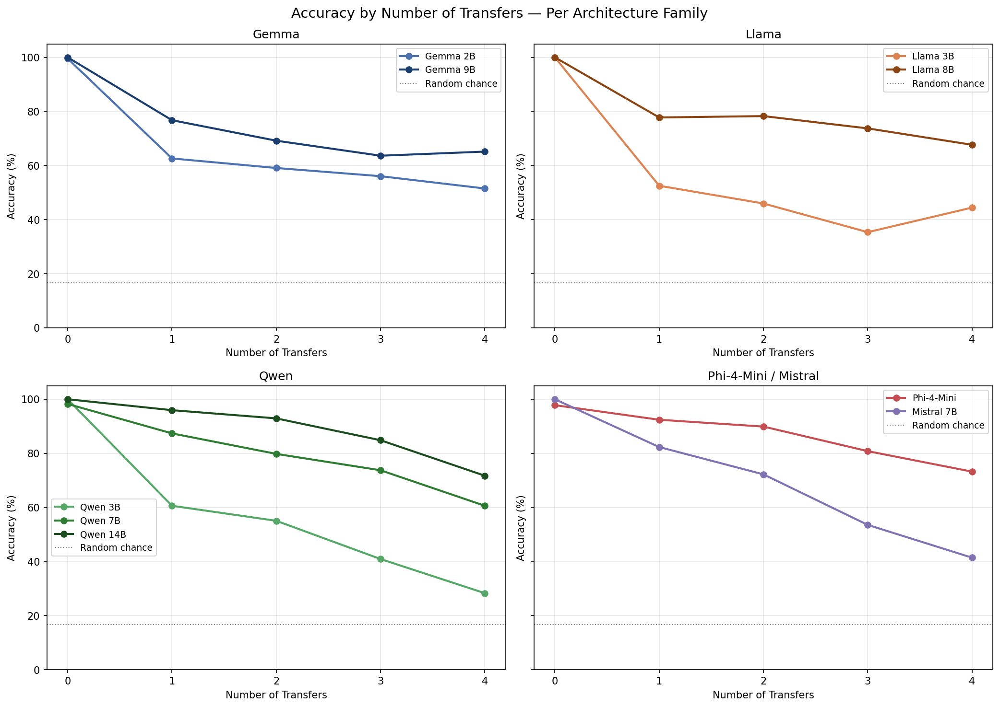
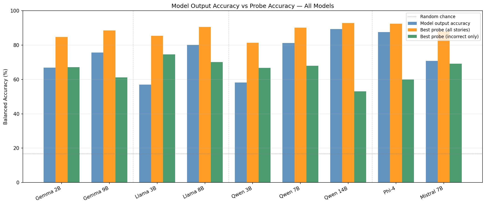
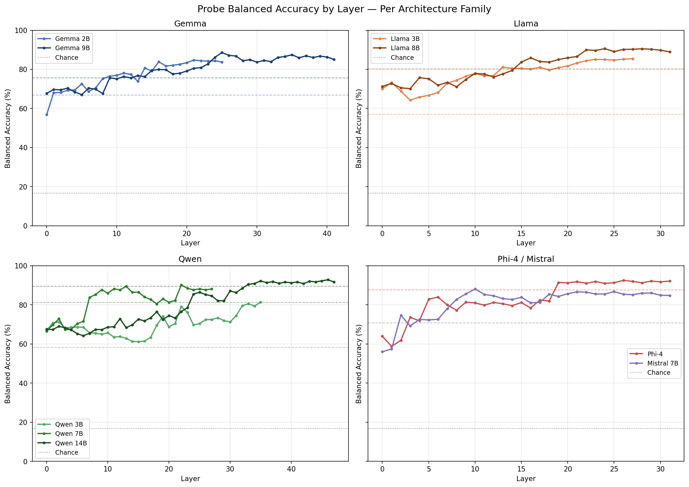
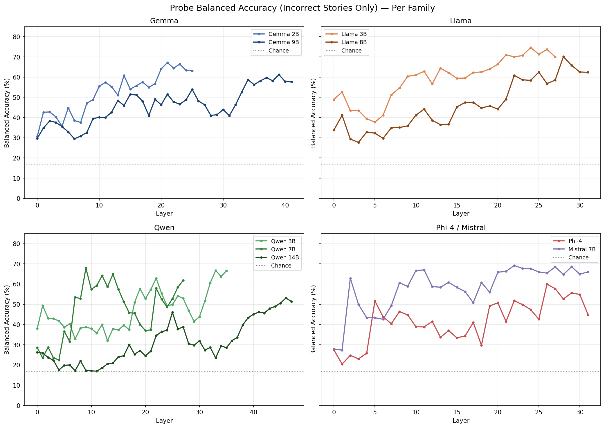

# Abstract

Tracking how entity states evolve across a narrative is a fundamental requirement for understand complex language. Yet, whether instruction-tuned language models can genuinely perform this tracking, or rely on surface-level heuristics remains underexplored. We investigate object state tracking—following an object's location as it is repeatedly moved through a story—across nine instruction-tuned language models spanning four architecture families and parameter range of 2B to 14B. Using a controlled synthetic dataset of 1,020 templated stories with systematic variation in complexity through changes in transfer count and distractor type and count, we evaluate both behavioral accuracy and internal representation via linear probing of residual stream activations. We find that that accuracy for all models degrades monotonically with transfer count. Additionally, linear probes trained on residual stream activations significantly outperform model outputs on failure cases across all nine models $(p < 0.0001)$, suggesting that state tracking failures reflect a readout problem rather than a storage problem.

# Introduction

Language models are increasingly deployed in settings that require
understanding how the world changes over time, Whether it be tracking
evolving news stories, tracking entities across dialogue turns, or
verifying consistency in long documents, a core capability underpinning
all of these is state tracking: the ability to follow how an entity's
properties change across a sequence of events.

Despite the significance of this capability, it remains unclear whether
modern instruction-tuned language models are able to genuinely perform
state tracking or rely on surface-level heuristics such as recency bias.
Understanding the nature of these failures is crucial as a model that
never encodes the correct state requires fundamentally different
intervention than one that encodes it correctly but fails to surface it
at output time.

In this work, we investigate object state tracking as a controlled proxy
for the broader capability. We construct a synthetic dataset of 1,020
templated stories in which objects are moved between locations across
multiple steps, with systematic variation in the number of state changes
and the type and count of distractors designed to mislead the model. We
evaluate nine instruction-tuned language models spanning four
architecture families (Gemma, Llama, Qwen, and Mistral/Phi) across a
parameter range of 2B to 14B, combining behavioral accuracy evaluation
with mechanistic analysis via linear probing of residual stream
activations.

Our key contributions are as follows:

-   A controlled synthetic dataset with systematic variation across
    transfer count (0-4), distractor type (location traps and red
    herring objects), and distractor count, designed such that correct
    answers cannot be retrieved by recency matching alone.

-   Behavioral evaluation across nine instruction-tuned models spanning
    four architecture families, revealing consistent monotonic accuracy
    degradation with transfer count across all models and architectures.

-   Mechanistic evidence that state tracking failures constitute a
    readout problem rather than a storage problem: linear probes trained
    on residual stream activations decode the correct location
    significantly above random chance on failure cases across all nine
    models ($p < 0.0001$).

-   Analysis of layer-wise probe accuracy revealing that state tracking
    information crystallizes in middle-to-late layers across all model
    families, with the readout gap diminishing but not disappearing at
    higher parameter counts.

# Methodology

## Dataset Construction

We constructed a synthetic dataset to evaluate robustness to distractors
and misleading contextual information. Each example consisted of a short
story describing the movement of an object across a sequence of
locations, followed by a question asking for the object's final
location.

Stories are generated from a fixed vocabulary of objects, locations, and
person names. A base trajectory is created by sampling an object and
applying between 0 and 4 transfer operations, where each transfer moves
the object to a new location. The correct answer corresponds to the
object's final location after all transfers.

**Control:** A single object placement statement with no distractors.

-   e.g. Diya puts the notebook on the bed. Where is the notebook?

**Distractor:** Additional irrelevant sentences referencing previous
locations are inserted at random positions within the story. These
distractors are semantically related to locations but do not alter the
tracked object state.

-   e.g. Shrujal puts the pen on the floor. Manasvini's favorite spot is
    the floor. Soha places the pen on the table. Where is the pen?

**Red Herring:** Additional objects are introduced and moved to a
previous location associated with the target object, adding semantically
similar but logically irrelevant details.

-   e.g. Nithin places the pen on the floor. Kaviya moves the book to
    the floor. Yamha places the pen on the shelf. Where is the pen?

For distractor and red herring stories, the number of object transfers
was varied from 0-4 and the number of distractor sentences was varied
systematically across conditions. For each transfer/distractor
configuration, 33 stories were generated using a fixed random seed,
producing 495 distractor stories and 495 red herring stories. Combined
with 30 control examples covering all object-location pairs, the final
dataset contained 1,020 stories.

The ground-truth label always corresponded to the target object's final
location after all transfer operations. Importantly, distractor
sentences and red-herring object placements frequently referenced
previously valid locations after the target object had already moved,
ensuring that shallow recency-based heuristics would often predict
incorrect answers.

## Behavioral Evaluation

Each prompt was of the format:

`[story] Where is the [object]? Answer with only the location word, nothing else.`

The model generates up to 10 tokens and the first token matching a valid
location string is taken as the prediction. The predicted location is
then compared against the establisted ground truth for that story and
the result is marked as correct/incorrect.

Notably, the prompt was previously of the format:

`[story] The [object] is on the`

We opted for the current formatting as it better aligns with the
question-based prompting expected by instruction-tuned models. We
generally observed better accuracy with the current prompt format as
opposed to this one.

## Models
**Table 1:** We analyzed the behavior of the following models.
| Model | Family | Parameters |
|---|---|---|
| Gemma 2 2B IT | Gemma | 2B |
| Gemma 2 9B IT | Gemma | 9B |
| Llama 3.2 3B Instruct | Llama | 3B |
| Llama 3.2 8B Instruct | Llama | 8B |
| Qwen 2.5 3B Instruct | Qwen | 3B |
| Qwen 2.5 7B Instruct | Qwen | 7B |
| Qwen 2.5 14B Instruct | Qwen | 14B |
| Phi 4 Mini Instruct | Phi | 3.8B |
| Mistral 7B Instruct v0.3 | Mistral | 7B |

All models were loaded from HuggingFace in float16. Inference was run on
Rutgers University iLab GPU Cluster (NVIDIA RTX A4000/A6000).

## Mechanistic Probing

To analyze whether models internally represented the correct object
location, we extracted residual stream activations from every
transformer layer during inference. Specifically, for each story we
recorded the hidden state at the final input token position after each
transformer block (excluding the embedding layer), producing one
activation vector per layer.

For each layer independently, we trained a linear probe to predict the
correct location from the residual activation alone. Probes consisted of
a logistic regression classifier with StandardScaler normalization and
balanced class weighting. The task was framed as 6-way classification
over possible object locations.

Probe performance was evaluated using repeated stratified
cross-validation (5 folds, 1 repeat) and measured primarily using
balanced accuracy to account for class imbalance across locations.

We evaluated two probing conditions:

-   **All stories:** probes were trained and evaluated across the full
    dataset to measure whether the correct location was linearly
    decodable from the residual stream.

-   **Incorrect stories only:** probes were trained exclusively on
    examples where the model's generated answer was incorrect.
    Above-chance probe accuracy in this setting indicates that the model
    internally encoded the correct location despite failing to produce
    it behaviorally.

Activations were extracted in a separate forward pass from behavioral
inference using `output_hidden_states=True`.

To evaluate whether probe performance exceeded baseline behavior, we
additionally performed one-sided one-sample t-tests across layers. For
incorrect-only probes, balanced accuracy was compared against
random-chance performance (16.7%). For probes trained on all stories,
balanced accuracy was compared against the model's behavioral accuracy.

# Experiments & Results

## Behavioral Results

Table 2 summarizes overall behavioral accuracy
across all nine models. Controls achieve near-perfect accuracy across
all models, confirming that the task format is well-posed and that
failures on harder conditions reflect genuine state tracking difficulty
rather than prompt or formatting artifacts.

**Table 2:** Behavioral accuracy by story type across all models.

| Model | Overall | Control | Distractor | Red Herring |
|---|---|---|---|---|
| Gemma 2B | 66.8% | 100% | 64% | 67% |
| Gemma 9B | 75.7% | 100% | 75% | 75% |
| Llama 3B | 57.0% | 100% | 51% | 60% |
| Llama 8B | 80.1% | 100% | 81% | 78% |
| Qwen 3B | 58.2% | 100% | 53% | 61% |
| Qwen 7B | 81.2% | 97% | 81% | 79% |
| Qwen 14B | 89.4% | 100% | 88% | 90% |
| Phi-4-Mini | 87.6% | 83% | 87% | 87% |
| Mistral 7B | 70.8% | 100% | 70% | 70% |

Figure 1 shows accuracy as a function of
transfer count broken down by architecture family. Every model exhibits
monotonic accuracy degradation as transfer count increases, and this
pattern holds consistently across all four families. The Qwen family
shows the strongest overall performance, with Qwen 14B maintaining above
70% accuracy even at four transfers. The Gemma and Llama families
degrade more steeply, with smaller models in each family dropping below
50% at three or more transfers. Importantly, within every family, larger
models outperform smaller ones at higher transfer counts, suggesting
that scale provides some benefit for state tracking but does not
eliminate degradation.

*Figure 1: Accuracy by number of transfers per architecture family.*

Across story types, distractor stories are generally harder than red
herring stories for most models. This suggests that explicit re-mention
of old locations in trap sentences is more disruptive than having a
different object moved to an old location, which requires
entity-specific tracking to resolve correctly.

## Probing Results

To investigate whether behavioral failures reflect a failure to encode
the correct state or a failure to surface it, we analyze residual stream
activations via linear probing.

Figure 2 shows model output accuracy alongside the
best probe accuracy on all stories and on incorrect stories only, for
each model.

*Figure 2: Model output accuracy vs. best probe accuracy on all stories and incorrect stories only.*

**Claim 1: Correct state is encoded even in failure cases.** For all
nine models, probe accuracy on incorrect stories significantly exceeds
chance (16.7%) across layers ($p < 0.0001$, one-sample t-test). The best
per-model probe accuracy on incorrect stories ranges from 53.1% (Qwen
14B) to 74.6% (Llama 3B), all substantially above random. This means
that on stories where the model outputs the wrong location, the correct
location is nonetheless decodable from internal representations —- the
model "knows" the right answer in some meaningful sense but fails to say
it.

**Claim 2: Probe accuracy exceeds model output accuracy.** For five of
nine models (Gemma 2B, Gemma 9B, Llama 3B, Qwen 3B, Mistral 7B), probe
accuracy on all stories significantly exceeds model output accuracy
($p < 0.05$). For the remaining four models (Llama 8B, Qwen 7B, Qwen
14B, Phi-4-Mini), this difference is not statistically significant.
Notably, these four are the highest-accuracy models in our set, with
output accuracies ranging from 80.1% to 89.4%. The probe-output gap
naturally shrinks as models get better at surfacing what they encode.
This is likely not because the readout mechanism has disappeared, but
because there are fewer failure cases to probe.

Figure 3 shows probe accuracy by layer for each
architecture family. Across all families, probe accuracy starts above
chance at layer 0 and builds through middle layers, typically plateauing
in the later third of the network. This suggests that state tracking
information is progressively constructed through the network rather than
encoded all at once. The Qwen family shows a particularly interesting
pattern: Qwen 14B stays relatively flat until approximately layer 25
before jumping sharply, suggesting that larger Qwen models defer state
resolution to deeper processing stages.

*Figure 3: Probe balanced accuracy by layer per architecture family.*

Figure 4 shows probe accuracy on incorrect
stories only by layer. Even restricted to failure cases, probe accuracy
climbs well above chance across all families and stays there through the
final layers. This is the most direct evidence that the residual stream
encodes correct state information that simply does not propagate to the
model's output.

*Figure 4: Probe balanced accuracy on incorrect predictions only, by layer per family.*

## Storage vs. Readout

The probing results across all nine models point to a consistent
conclusion that state tracking failures in instruction-tuned language
models are predominantly a readout problem, not a storage problem. The
correct location is encoded in the residual stream, as a linear
classifier can recover it with well above chance accuracy, but something
in the final layers fails to translate that representation into the
correct output token.

This distinction matters practically. A storage failure would imply the
model fundamentally lacks the capacity to track state, requiring
architectural changes or large-scale retraining. A readout failure, by
contrast, is more targeted: the information is there, and interventions
at the output stage, such as probe-based decoding, targeted fine-tuning
of later layers, or steering vectors, could in principle recover it
without touching the model's core representations.

The readout gap also shrinks with scale as the four highest-accuracy
models show no statistically significant difference between probe and
output accuracy. But claim 1, that correct state is encoded even in
failure cases, holds universally across all nine models regardless of
size or architecture. This suggests that while scaling helps models
better utilize their internal representations, the underlying tendency
to encode state correctly but occasionally fail to surface it is a
persistent property of the transformer architecture at this scale range.

# Conclusion

This work investigates whether instruction-tuned language models
genuinely track object state across multi-step narratives or fail at
state overwriting. Across nine models spanning four architecture
families, we find two consistent results. First, accuracy degrades
monotonically with the number of state changes regardless of model size
or architecture, with larger models degrading more slowly but never
eliminating the pattern. Second, and more importantly, linear probes
trained on residual stream activations decode the correct location
significantly above chance on failure cases across all nine
models—establishing that state tracking failures are a readout problem
rather than a storage problem. The correct information is present in the
model's internal representations but something in the final layers fails
to surface it.

These findings have practical implications. Since the failure is
localized to the readout mechanism rather than the representational
capacity, targeted interventions such as probe-based decoding, steering
vectors, or fine-tuning of later layers are more promising directions
than retraining or large architectural changes.

This study has several limitations worth acknowledging. The dataset is
synthetic and templated, with only six possible locations and five
objects. Real-world state tracking involves far more complex narratives,
ambiguous references, and larger state spaces. Additionally, our
analysis is restricted to models up to 14B parameters; it remains an
open question whether the readout gap persists at larger scales.

Future work should investigate the specific mechanism behind the readout
failure using activation patching—swapping activations between correct
and incorrect runs to identify which components are responsible.
Extending this analysis to real-world text such as news articles or
clinical narratives, and testing whether targeted fine-tuning can close
the readout gap without affecting general performance, are also natural
next steps.

# Reproducibility

To reproduce our results:

1.  Generate the dataset: `python story_generation.py`

2.  Run behavioral inference (set `MODEL_SIZE` as argument):
    `python inference.py –model_size gemma2b`

3.  Run probing: `python probing.py –model_size gemma2b`

4.  Generate plots and statistical tests: `python probing_analysis.py`
    and `python plots.py`

All experiments were run on the Rutgers University iLab GPU cluster
using NVIDIA RTX A4000 and A6000 GPUs. Model weights are available via
HuggingFace; gated models (Gemma, Llama) require accepting the
respective license agreements.
