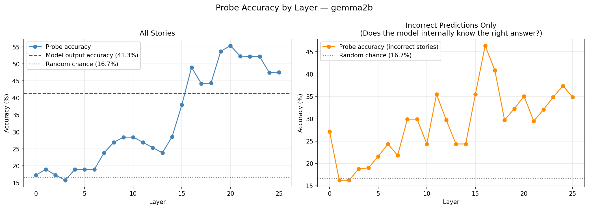
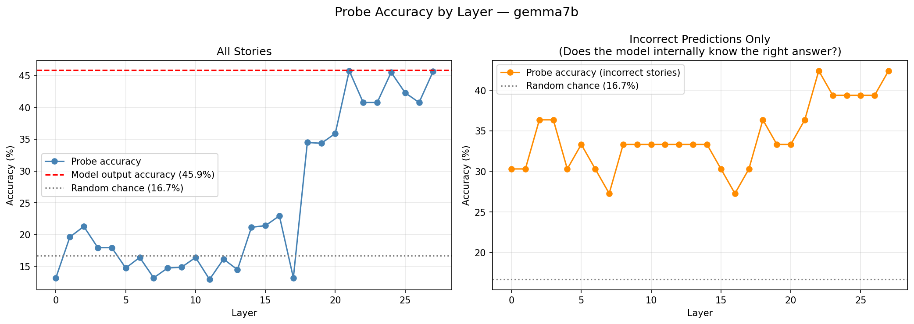

# Object-State-Tracking-in-Language-Models

## What I Investigated and Why

Can language models actually track how the world changes across a narrative, or do they just latch onto the most recently mentioned location? This project investigates object state tracking — following an object's location as it gets moved repeatedly through a story — and asks whether failure is a *storage* problem (the model never encoded the right answer) or a *readout* problem (the answer is internally represented but doesn't surface in the output).

This distinction matters for alignment: a model that knows the right answer but can't say it is a fundamentally different failure mode than one that never processed the information at all.

Additionally, state tracking is fundamental to how AI systems process evolving narratives in news, social media, and interactive storytelling. Understanding where these models fail has direct implications for AI-assisted content analysis

## Dataset

I generated 63 templated stories across three conditions:

- **Distractor**: location trap sentences mentioning old locations after the final move (e.g. "Diya's favorite spot is the shelf") to test whether the model gets confused by re-surfaced old locations
- **Red Herring**: a different object gets moved to an old location after the target object's final move, testing entity-specific state tracking
- **Control**: zero-transfer stories with no distractors, establishing a clean baseline

Each story varies across number of transfers (0–4), number of location distractors, and number of random distractors. Ground truth is always the last actual location of the target object, never the last location mentioned — ensuring the task requires genuine state tracking rather than recency matching.

## Models

I initially ran experiments on Pythia (160m, 1.4b, 6.9b) but found the results unreliable — as base models, Pythia is trained for text completion rather than question answering, making it sensitive to prompt format in ways that confound the state tracking signal. I switched to **Gemma 2 2B-IT and 7B-IT** (instruction tuned), which produced clean 100% control accuracy and interpretable behavioral results.

## Approach and Methodology

### Behavioral Evaluation
Each story was prompted as:
[story] The [object]is in the

The top-5 predicted tokens were checked against valid locations. Accuracy was measured across transfer counts, distractor counts, and story types for both models.

### Mechanistic Probing
For each story, I extracted residual stream activations at the final token position across every layer. I then trained a logistic regression classifier (5-fold cross validation, 3-fold for incorrect-only subset due to small sample size) per layer to predict the correct location from the activation vector alone, independently of what the model actually output. This lets me ask: *is the correct answer encoded internally even when the output is wrong?*

## Key Findings

### 1. Both models fail at 3+ transfers

| Transfers | Gemma 2B | Gemma 7B |
|---|---|---|
| 0 | 81% | 81% |
| 1 | 58% | 58% |
| 2 | 25% | 42% |
| 3 | 17% | 33% |
| 4 | 18% | 9% |

Scaling from 2B to 7B helps at 2–3 transfers but both models collapse at high transfer counts. This suggests state overwriting is a fundamental failure mode not resolved by scale alone.

### 2. The model knows more than it says

Probing reveals a clear dissociation between internal representation and output behavior:

| | Gemma 2B | Gemma 7B |
|---|---|---|
| Model output accuracy | 41.3% | 45.9% |
| Best probe accuracy | 55.4% (layer 20) | 45.8% (layer 21) |
| Probe on incorrect stories | 46.4% (layer 16) | 42.4% (layer 22) |
| Random chance | 16.7% | 16.7% |

In Gemma 2B, a linear probe trained on layer 20 activations achieves 55.4% accuracy, significantly above both random chance and the model's own output accuracy. On stories the model got *wrong*, the probe still achieves 46.4%, nearly 3 times random chance. **Information towards the correct location is encoded internally but fails to surface in the output.**

### 3. State tracking crystallizes at different layers across scales




In Gemma 2B, probe accuracy climbs gradually from layer 7 and peaks at layer 20. In Gemma 7B, accuracy stays near random chance until layer 17, then jumps sharply, suggesting the larger model defers state tracking to later, deeper processing. Notably, Gemma 7B's right plot shows above-chance probe accuracy even at layer 0 on incorrect stories, suggesting early encoding of location information that doesn't reliably propagate.

### 4. The failure is a readout problem, not a storage problem

The gap between probe accuracy and output accuracy is larger in 2B (14 percentage points) than 7B (near zero). This means 7B is better at surfacing what it knows, the readout mechanism improves with scale even when behavioral accuracy doesn't dramatically improve.

## Problems Faced and Workarounds

- **Prompt format sensitivity**: Base models (Pythia) were highly sensitive to prompt phrasing — "The pen is on the" didn't work well for locations like "drawer" since objects aren't naturally described as being "on" a drawer. Switched to instruction-tuned Gemma models which handled question answering cleanly.
- **Location vocabulary**: Initial location sets included "nightstand" which tokenizes as two tokens ("night" + "stand"), causing the model to never match valid locations in top-5. Replaced with single-token locations only.

## Future Scope

- **Activation patching**: Having localized the failure to a readout problem, the natural next step is causal patching, swapping activations between correct and incorrect runs at specific layers to identify exactly which components are responsible for the failure
- **Attention analysis**: Visualizing which tokens the final position attends to in failure cases, does it attend to old locations rather than the most recent move?
- **Larger scale**: Testing Gemma 27B or other larger models to see if the readout gap closes entirely at scale
- **Fine-tuning intervention**: Can targeted fine-tuning on state tracking examples fix the readout failure without affecting general performance?

## Reproducing Results

```bash
git clone [repo]
pip install torch transformers accelerate scikit-learn matplotlib

# generate dataset
python3 generate_dataset.py

# run inference (change MODEL_SIZE at top of file)
python3 inference.py

# run probing (change MODEL_SIZE at top of file)
python3 probing.py
```
